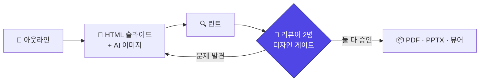

<div align="center">

# slide-decks-start

**Claude Code에 문서나 주제를 주면, 품질 검수까지 끝난 슬라이드 덱이 나옵니다.**

[English](README.md) · [한국어](README.ko.md)

</div>

```
/slide-decks-start docs/onboarding.md
```

명령 한 줄이면 아웃라인 작성, 슬라이드 HTML 디자인, 필요한 곳 이미지 생성,
리뷰 검수까지 거쳐 발표 가능한 PDF가 나옵니다.

## 이런 게 나옵니다

아래 슬라이드 전부 이 스킬이 만들었습니다 — 수작업 디자인 없음:

| | | |
|:---:|:---:|:---:|
|  |  |  |
|  |  |  |

*위: executive-navy 스타일(연구 브리핑). 아래: clean-white 스타일 + AI 생성 이미지(제품 소개).
전체 소스는 [examples/](examples/)에.*

## 빠른 시작

```bash
# 1. 스킬 설치 (한 번만)
git clone https://github.com/lsmman/ai-slide-pipeline.git
cp -r ai-slide-pipeline/skills/slide-decks-start ~/.claude/skills/
npx playwright install chromium

# 2. 아무 프로젝트에서, Claude Code 안에서
/slide-decks-start docs/plan.md          # 파일로부터
/slide-decks-start "우리 팀 온보딩"        # 주제만으로
```

그냥 말해도 됩니다: *"이 문서로 PPT 만들어줘"*, *"슬라이드로 정리해줘"*.
아웃라인만 한 번 승인하면 나머지는 알아서 돕니다. 끝나면 PDF + 브라우저 뷰어를 받고,
*"7번 슬라이드 고쳐줘"* 하면 다시 렌더·검수해서 갱신합니다.

## 품질은 이렇게 보장됩니다

이 스킬은 자기 초안을 믿지 않습니다. 내보내기 전에 반드시:

1. **린트** — 슬라이드 전부를 헤드리스 렌더해서 잘린 텍스트, 프레임 밖 요소,
   깨진 레이아웃을 검사합니다.
2. **디자인 리뷰** — 독립 리뷰어 에이전트 2명이 렌더된 전체 슬라이드를 봅니다:
   한 명은 디자인 시스템 준수(색·타입 스케일·일관성), 다른 한 명은 청중의 눈
   (가독성·한글 조판·3초 스캔).
3. **잠금** — 둘 다 승인하기 전에는 내보내기 명령이 말 그대로 실행을 거부합니다.
   고치고, 다시 렌더하고, 다시 리뷰받아야 잠금이 풀립니다.



## 무엇이 다른가

- **한글 조판 내장** — `word-break: keep-all`, 최소 글자 크기, 어절 중간 줄바꿈 금지.
  실제 리뷰에서 걸렸던 실패들이 규칙이 되어 첫 렌더부터 적용됩니다
- **텍스트와 안 싸우는 이미지** — [7슬롯 프롬프트 템플릿](skills/slide-decks-start/references/image-prompting.md)이
  텍스트 자리를 미리 비우고, 색을 헥스로 고정하고, 덱 전체 이미지를 한 스타일로 묶습니다.
  `codex login` 재사용, API 키 불필요. 없으면 이미지 없이 진행
- **스타일** — 기본 clean-white+인디고, 컨설팅 보고서용
  [executive-navy](skills/slide-decks-start/styles/executive-navy.slides.md) 동봉,
  기반 엔진의 35종도 선택 가능
- **감이 아니라 영수증** — 리뷰 보고서는 렌더 PNG와 소스 체크섬을 인용하고,
  남은 지적사항은 debt 로그로 추적됩니다 — 조용히 버려지지 않습니다

## 참고

<details>
<summary><b>요구 사항</b></summary>

| 항목 | 용도 | 필수 |
|---|---|---|
| Node 18+ | slides-grab CLI (`npx -y slides-grab`, 설치 불필요) | ✅ |
| Playwright Chromium | 렌더·검증 | ✅ |
| `codex login` | AI 이미지 생성 (API 키 불필요) | 선택 |

</details>

<details>
<summary><b>저장소 구조</b></summary>

```
skills/slide-decks-start/
├── SKILL.md                        # 절차 + 함정 퀵레퍼런스
├── references/image-prompting.md   # 7슬롯 이미지 프롬프트 가이드
└── styles/executive-navy.slides.md # 커스텀 스타일 스펙
tools/slides-grab-mcp/              # (선택) MCP 서버
examples/                           # 완성 덱 소스 2종
```

</details>

<details>
<summary><b>선택: MCP 서버</b></summary>

[tools/slides-grab-mcp](tools/slides-grab-mcp/server.js)가 CLI를 function calling 툴
11개로 노출합니다 (`validate`, `design_gate`, `render_png`, `export_pdf`,
`generate_image` 등). [.mcp.json](.mcp.json) 복사 + `npm install`로 활성화.
CLI만으로도 스킬은 완전히 동작합니다.

</details>

<details>
<summary><b>예제 다시 빌드하기</b></summary>

```bash
npx slides-grab build-viewer --slides-dir examples/j-space/slides
open examples/j-space/slides/viewer.html
```

`claude-code-intro`의 이미지 에셋은 레포에 없습니다 — 스킬로 재생성하세요.

</details>

## 크레딧

CLI·검증·디자인 게이트 잠금을 제공하는 agent-first 프레젠테이션 프레임워크
[slides-grab](https://github.com/NomaDamas/slides-grab) 위에서 동작합니다.

MIT License
