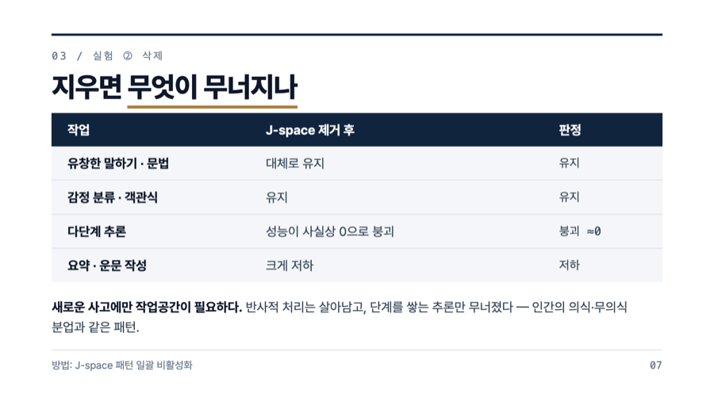
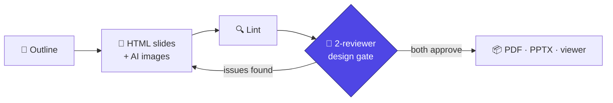

<div align="center">

# slide-decks-start

**Give Claude Code a document or a topic. Get back a finished, quality-checked slide deck.**

[English](README.md) · [한국어](README.ko.md)

</div>

```
/slide-decks-start docs/onboarding.md
```

One command produces the outline, designs every slide as HTML, generates images where
they help, has the result reviewed, and hands you a PDF you can present.

## What it makes

Every slide below was produced by this skill — no manual design work:

| | | |
|:---:|:---:|:---:|
|  |  |  |
|  |  |  |

*Top: executive-navy style (research briefing). Bottom: clean-white style with AI-generated images (product intro).
Full sources in [examples/](examples/).*

## Quick start

```bash
# 1. install the skill (once)
git clone https://github.com/lsmman/ai-slide-pipeline.git
cp -r ai-slide-pipeline/skills/slide-decks-start ~/.claude/skills/
npx playwright install chromium

# 2. use it in any project, inside Claude Code
/slide-decks-start docs/plan.md          # from a file
/slide-decks-start "team onboarding"     # from just a topic
```

Plain requests work too: *"make a deck from this doc"*, *"이 문서로 PPT 만들어줘"*.
You approve the outline once; the rest runs on its own. When it finishes you get a PDF,
a browser viewer, and an edit loop — say *"fix slide 7"* and it re-renders and re-checks.

## How quality is enforced

The skill doesn't trust its own first draft. Before anything is exported:

1. **Lint** — every slide is rendered headlessly and checked for clipped text,
   elements outside the frame, and broken layouts.
2. **Design review** — two independent reviewer agents look at every rendered slide:
   one checks the design system is followed (colors, type scale, consistency),
   the other reads it like your audience would (legibility, Korean typography, 3-second scan).
3. **The lock** — the export command literally refuses to run until both reviewers
   sign off. Fix, re-render, re-review, then export unlocks.



## Why it's different

- **Korean typography built in** — `word-break: keep-all`, minimum type sizes,
  no mid-word line breaks. Rules learned from real review failures, applied from the first render
- **Images that don't fight your text** — a [7-slot prompt template](skills/slide-decks-start/references/image-prompting.md)
  reserves the text zone, fixes the palette by hex, and keeps every image in one visual style.
  Uses your `codex login`; no API key. Skipped gracefully if unavailable
- **Styles** — clean-white + indigo by default, a consulting-grade
  [executive-navy](skills/slide-decks-start/styles/executive-navy.slides.md) spec included,
  35 more selectable from the underlying engine
- **Receipts, not vibes** — reviewer reports cite rendered PNGs and source checksums;
  leftover nitpicks are tracked in a debt log instead of silently dropped

## Reference

<details>
<summary><b>Requirements</b></summary>

| Item | Used for | Required |
|---|---|---|
| Node 18+ | slides-grab CLI (`npx -y slides-grab`, no install) | ✅ |
| Playwright Chromium | rendering & validation | ✅ |
| `codex login` | AI image generation (no API key) | optional |

</details>

<details>
<summary><b>Repository layout</b></summary>

```
skills/slide-decks-start/
├── SKILL.md                        # procedure + pitfall quick reference
├── references/image-prompting.md   # 7-slot image prompt guide
└── styles/executive-navy.slides.md # custom style spec
tools/slides-grab-mcp/              # (optional) MCP server
examples/                           # two finished deck sources
```

</details>

<details>
<summary><b>Optional MCP server</b></summary>

[tools/slides-grab-mcp](tools/slides-grab-mcp/server.js) exposes the CLI as 11
function-calling tools (`validate`, `design_gate`, `render_png`, `export_pdf`,
`generate_image`, …). Copy [.mcp.json](.mcp.json) and `npm install` to enable.
The skill works fully with the CLI alone.

</details>

<details>
<summary><b>Rebuild the examples</b></summary>

```bash
npx slides-grab build-viewer --slides-dir examples/j-space/slides
open examples/j-space/slides/viewer.html
```

`claude-code-intro`'s image assets are excluded from the repo — regenerate them with the skill.

</details>

## Credits

Built on [slides-grab](https://github.com/NomaDamas/slides-grab), the agent-first
presentation framework that provides the CLI, validation, and the design-gate lock.

MIT License
