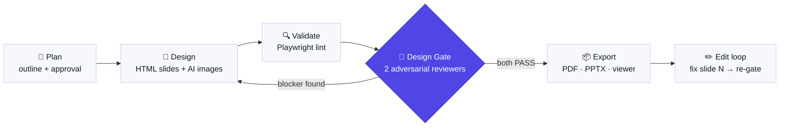

<div align="center">

# slide-decks-start

**A Claude Code skill that turns a file path or a one-line topic into a validated slide deck (PDF/PPTX).**

[English](README.md) · [한국어](README.ko.md)

</div>



```
/slide-decks-start docs/onboarding.md
```

Exports are **locked behind a design gate**: two reviewer subagents inspect every rendered
slide (system-contract integrity + audience readability), and the PDF/PPTX commands refuse
to run until both return PASS.

## Install

```bash
git clone https://github.com/lsmman/ai-slide-pipeline.git
cp -r ai-slide-pipeline/skills/slide-decks-start ~/.claude/skills/
```

That's it — Claude Code picks it up in any project.

### Requirements

| Item | Used for | Required |
|---|---|---|
| Node 18+ | slides-grab CLI (`npx -y slides-grab`, no install) | ✅ |
| Playwright Chromium | rendering & validation | ✅ `npx playwright install chromium` |
| `codex login` | AI image generation (no API key) | optional — falls back to CSS backgrounds |

## Usage

```bash
/slide-decks-start docs/plan.md        # a file into a deck
/slide-decks-start "team onboarding"   # or just a topic
```

Natural-language triggers also work: *"make a deck from this doc"*, *"이 문서로 PPT 만들어줘"*.

1. **Plan** — outline generated → user approval checkpoint
2. **Design** — one self-contained HTML per slide (720×405pt, Pretendard), AI images where they earn their place
3. **Validate** — Playwright lint: clipped text, frame overflow, empty canvases
4. **Design Gate** — reviewer A (design-system contract) + reviewer B (audience readability, Korean typography) read every rendered PNG; evidence = PNG filenames + source sha256 fingerprints
5. **Export** — PDF (primary), PPTX (experimental), browser viewer
6. **Edit** — "fix slide 7" → edit → re-validate → re-gate → re-export

## What's inside

- **[SKILL.md](skills/slide-decks-start/SKILL.md)** — the pipeline procedure plus a
  field-tested pitfall table (Korean `word-break: keep-all`, 10pt floor, flex-collapsed
  decorations, hyphenated-token line breaks…) so the first render already avoids them
- **[7-slot image prompting guide](skills/slide-decks-start/references/image-prompting.md)** —
  MEDIUM · SUBJECT (metaphor) · COMPOSITION (**reserved text zone**) · COLOR (hex + ratios) ·
  STYLE ANCHOR (deck-wide consistency) · RENDER · NEGATIVES. Backgrounds that never fight your headline
- **[executive-navy style](skills/slide-decks-start/styles/executive-navy.slides.md)** —
  consulting-report tone: navy + bronze, typography-driven, no images. Default style is
  clean-white + indigo; slides-grab's 35 bundled styles are also selectable
- **[MCP server](tools/slides-grab-mcp/server.js)** *(optional)* — exposes the slides-grab CLI
  as 11 function-calling tools (`validate`, `design_gate`, `render_png`, `export_pdf`,
  `generate_image`, …). Copy [.mcp.json](.mcp.json) + `npm install`. The skill works fine with CLI only

## Examples

| Deck | Style | Notes |
|---|---|---|
| [examples/j-space](examples/j-space) | executive-navy, image-free | 12-slide executive briefing on Anthropic's global-workspace research |
| [examples/claude-code-intro](examples/claude-code-intro) | clean-white + 3 AI images | 12-slide Claude Code intro (image assets excluded — regenerate via the skill) |

```bash
npx slides-grab pdf --slides-dir examples/j-space/slides --output j-space.pdf
npx slides-grab build-viewer --slides-dir examples/j-space/slides && open examples/j-space/slides/viewer.html
```

## Repository layout

```
skills/slide-decks-start/
├── SKILL.md                        # procedure + pitfall quick reference
├── references/image-prompting.md   # 7-slot image prompt guide
└── styles/executive-navy.slides.md # custom style spec
tools/slides-grab-mcp/              # (optional) MCP server
examples/                           # two finished deck sources
```

## License

MIT
